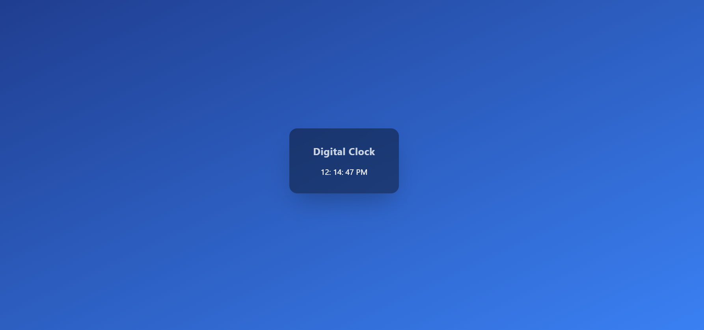

# ⏰ Digital Clock – Tailwind CSS

A modern **Digital Clock** built using **HTML, Tailwind CSS, and JavaScript**.  
It displays the current time in **12-hour format with AM/PM** and updates every second.

---

## 🔥 Features

- Live running digital clock
- 12-hour format with AM / PM
- Glassmorphism UI design
- Responsive and mobile-friendly
- Built using Tailwind CSS CDN
- Clean and beginner-friendly code

---

## 🛠️ Technologies Used
- HTML5
- Tailwind CSS
- JavaScript (Date Object)

---

## 📂 Project Structure

digital-clock/
│── index.html # Main HTML file
│── README.md # Project documentation

## 🚀 How to Run the Project

1. Download or clone this repository  
2. Open `index.html` in any modern browser  
3. The digital clock will start automatically

---

## 📸 Preview

[live@](https://digiclocktime.netlify.app/)

---

## ✍️ Author

**Archana K R**  
Beginner Web Developer | Learning Tailwind CSS & JavaScript

---

## 📄 License

This project is open-source and free to use for learning and practice

